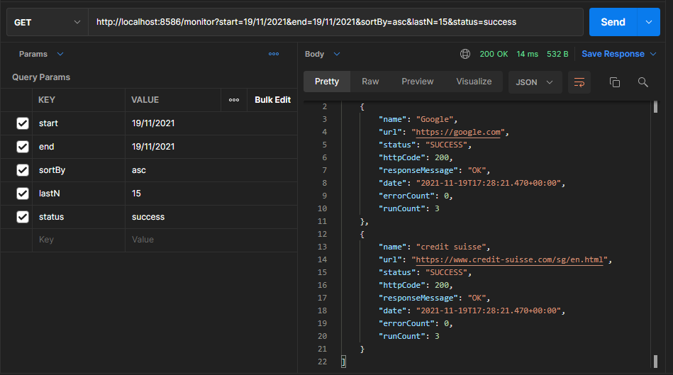
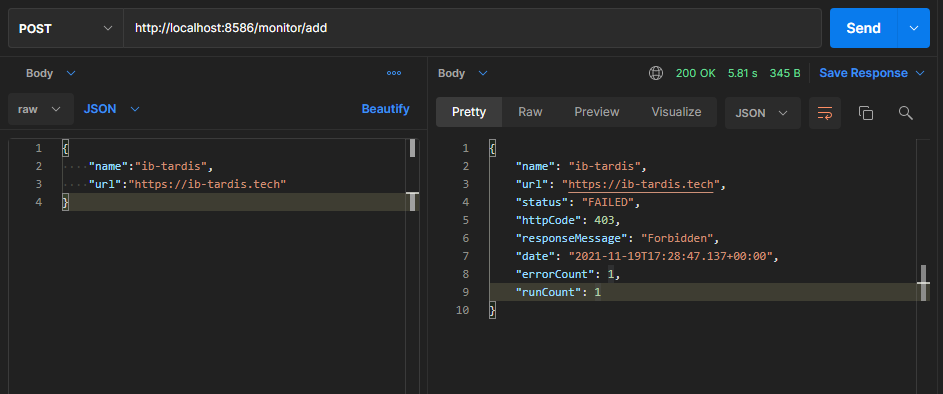

# csv-service-monitor

## Configure application

- Modify properties in application.properties under resources
    - server.port: HTTP port to start application on
    - config.interval.sec: Interval in between of two scans
    - config.filename: CSV filename which holds data
    - config.alertOnNumberOfFailures: Number of failures to trigger notification
    - ore data can be added to sample-data.csv in data directory

- To Start Application
    ```
    cd monitor-service
    mvn spring-boot:run
    ```
## Approch used
- Created storage class to share data within application
- Used OpenCSV library to parse csv data to beans
- Tried using streams

## Screenshots
- Get Status


- Add URL for monitoring
